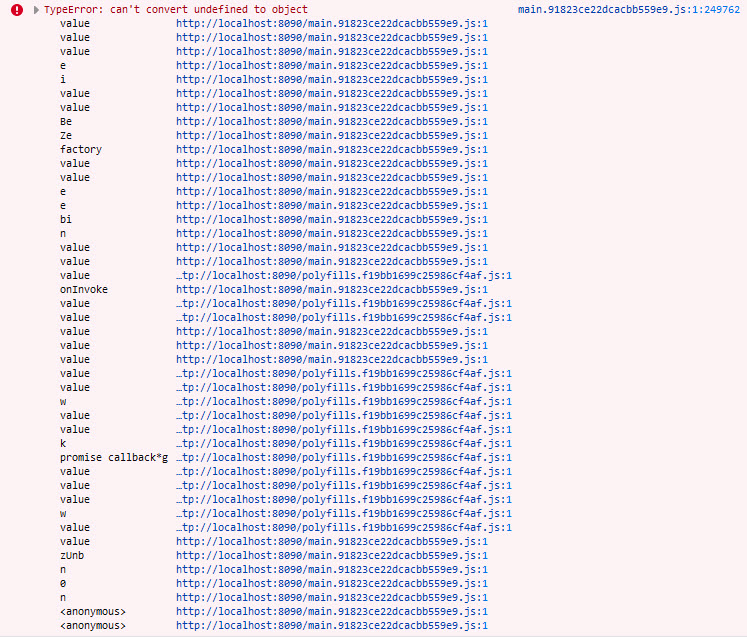
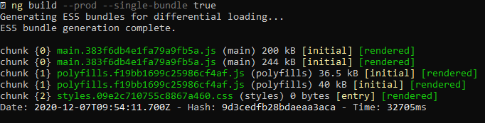

# ng-microfrontend-issue-demo

### Introduction

The intent of this project is to demonstrate an intermittent issue being faced while creating Micro-frontends.

### Design

This is an attempt to adopt the design provided in the work of Manfred Streyer. His [article](https://www.angulararchitects.io/aktuelles/micro-apps-with-web-components-using-angular-elements/) and the [concept code](https://github.com/manfredsteyer/angular-microapp/) he provides form the basis of this project.

This project comprises of three distint Angular Projects:

1. The App Shell
2. App One
3. App Two

### Getting it running

- Build the individual Micro Applications while ensuring that only a single bundle gets created

  ```
  # Building Application One
  cd app-one


  ng build --prod --single-bundle true


  # Building Application Two
  cd app-two


  ng build --prod --single-bundle true


  ```

- Update the `src\configs\config.json` file in the Application Shell with the bundle files that were created in the build step above
  ```
  cd app-shell\src\configs\
  code .\configs.json  # Assuming you are using VS Code to edit
  ```

- Now serve the two different Micro Applications as separate websites, separate ports. The following lines of code use the `http-server` node package to serve the different applications as an example. You may choose to serve it using a different web server.
  - First App One in one terminal window
    ```
    cd app-one\dist\app-one
    http-server . -p 8080 --cors
    ```

  - And then, serve App Two in a different terminal windwo
    ```
    cd app-two\dist\app-two
    http-server . -p 8090 --cors
    ```

- Now run the Application Shell
  ```
  cd app-shell
  ng serve -o
  ```

### Current Observation

We observe, that in the current scenario, there is an intermittent error that is thrown in the Browser console. This error happens only intermittently, and may disappear or manifest itself again when the individual micro-applications are built again and again.

This error is observed only when the two Micro Applications are built with the `--prod` flag. If we build the Micro Applications after disabling optimization and AOT compilation in their respective `angular.json` files, then this error disappears.



### Same codebase, different results per build

We also observe that if we run the build multiple times for the same codebase, the output and the outcome may be different.

An example of this is the `main.383f6db4e1fa79a9fb5a.js` file that is part of the build output for the Micro Application `app-one`. We ran the build for the `app-one` application multiple times and received the same filename as a result of both builds. But the contents of two are different.
- The build output from the commit [93f7cd4](https://github.com/kiranjholla/ng-microfrontend-issue-demo/commit/93f7cd4e341ae3e3c764578c2567ca6255301b1c) executes just fine and the application works
- The build output from the commit [a14aeaa](https://github.com/kiranjholla/ng-microfrontend-issue-demo/commit/a14aeaad39ac323e7e0c27bb77ea9d837a45d7e7) fails to execute and results in the above mentioned error.

Both the build outputs for the commit ids mentiond above, are from the exact same codebase.

This can lead us to believe that there is something in the build process that has resulted in the same codebase yielding different outputs. It is also possible that there is something in the structure of the code which causes the builds to produce differing results eventhough the SHA for the file is the same.

### Race Condition??

Whenever we run the command `ng build --prod --single-bundle true` we get an output similar to the one below:


You might notice that all files are rendered twice, whereas in the actual Build output there is only one file by that name. You might also notice that the sizes of the files rendered differ.
- The file `main.383f6db4e1fa79a9fb5a.js` has two sizes: one is of 200 kB and the other of 244 kB.

When we take a look at the two commits mentioned above, we notice that the size of the file that works (from commit [93f7cd4](https://github.com/kiranjholla/ng-microfrontend-issue-demo/commit/93f7cd4e341ae3e3c764578c2567ca6255301b1c)) is ~200 kB, where as the size of the file that results in an error (from commit [a14aeaa](https://github.com/kiranjholla/ng-microfrontend-issue-demo/commit/a14aeaad39ac323e7e0c27bb77ea9d837a45d7e7)) is ~245 kB.

Perhaps there are two versions of the file being generated, and one is overwriting the other because its generation completes after the first one?


### References

- [Micro Apps with Web Components using Angular Elements](https://www.angulararchitects.io/aktuelles/micro-apps-with-web-components-using-angular-elements/)
- [Micro Apps with Web Components and Angular Elements - Concept Code](https://github.com/manfredsteyer/angular-microapp/)
